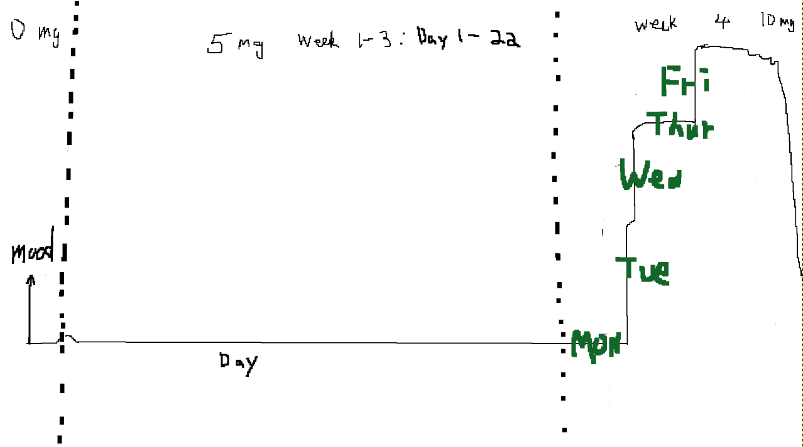

### 粵語翻譯 (Cantonese Translation)

---

### **畀精神科醫生嘅筆記**

---

#### **關於服用 Lexapro 嘅經歷**
- 開始每日服用 **5mg**，通常係 **凌晨5-6點**，瞓覺前食。
- 呢段時間瞓覺質素尚可，但無乜特別值得留意嘅事。

---

#### **第一、二星期**
- 初期影響：
  - 有幾次喺夜晚食藥會令我感覺好興奮。
  - 一共漏咗 **5日冇食藥**，但從未連續兩日冇食。
  - 試過兩次通宵打機後，喺早上同早餐一齊食藥，之後覺得想嘔。

---

#### **第三星期**
- **睡眠狀況：**
  - 建立咗較為穩定嘅瞓覺模式： **凌晨12點至1點瞓覺**，每日瞓 **6-7小時**。
  - 偶然會有短暫醒來嘅情況，通常喺瞓咗4-5小時之後，但好快又瞓得返。

- **生活改善：**
  - 正式申請 **停學假期**，開始建立健康嘅生活模式。
  - 喺輔導員嘅指導下，每日返學校。
  - 慢慢戒咗打機，少睇 Twitch，同減少睇色情內容，呢啲行為唔再變得強迫，生活變得更加平衡。

- **動機與情緒變化：**
  - 開始對 **網絡安全學習目標** 產生強烈嘅執著，特別係 CTF 比賽。呢種動機源於：
    - 尋求認同感。
    - 對未來有幫助。
    - 與我嘅身份認同相符。

---

#### **第四星期（10mg劑量）**
- **增量至10mg：**
  - **第一日食10mg**：無即時特別反應。
  - 第二日食10mg（隔咗34小時）：晚飯後散步時感受到一陣好強烈嘅愉快感。

- **正面影響：**
  - 感受到 **極度快樂、放鬆**，特別係晚飯後食藥後散步嘅時候。
  - 學習網絡安全時有明顯嘅動力提升，包括：
    - 對製作學習筆記感到興趣。
    - 發現以往學到嘅知識之間嘅聯繫。
    - 感覺到自己嘅身份逐漸轉變，越嚟越覺得自己係個「專注學習」嘅人。
  - 雖然有時夜晚會打機，但唔會感到內疚，因為喺輔導員指導下，呢啲都係為咗保持學習同娛樂嘅平衡。

- **困難：**
  - 瞓覺困難，特別係改用10mg後：
    - 晚上感到精神，但好難入睡。
    - 瞓咗4-5小時後會短暫醒來。
  - 對效率嘅過度執著，導致 **疲勞和精神崩潰**。當無法取得進展時，感到沮喪。

---

### **希望同醫生討論嘅問題**

---

#### **1. 睡眠問題**
- 轉為 **10mg** 後，睡眠問題加劇：
  - 晚上感到精神，但又經常打呵欠。
  - 最近試過朝早5-6點試勉強瞓得著
  - 瞓覺時有異常清醒嘅感覺
- **矛盾點：**
  - 雖然 Lexapro 令夜晚更難瞓覺，但晚飯後散步時帶嚟嘅愉快感又好明顯。

---

#### **2. 情緒同行為嘅變化**
- Lexapro 似乎放大咗我嘅 **快樂、溫暖同放鬆** 嘅感覺，令世界變得更「完美」。
- 影響咗我嘅身份認同：
  - 幻想完全投入「低多巴胺、高專注力」嘅生活方式，成為一個全職 CTF 學習者。
  - 發展出一種僵化嘅思維模式，將「成就感」視為工作嘅最大美德。

---

#### **3. 情緒突然下降**
- 星期日開始注意到情緒嘅明顯下降，可能因為：
  - 星期六晚瞓得唔好：只瞓咗4個鐘。
  - 對自己睡眠問題同學習進度感到困惑和擔憂。
  - 對呢啲轉變嘅憂慮越嚟越大
  - 失去咗之前嘅愉悅感（昨天下晝3點食藥之後）
  - 極度疲勞

- **症狀：**
  - 思維混亂，無法專注。
  - 突然有好多憂慮湧上心頭，特別係夜晚。

---

#### **4. 長期嘅專注力與認知問題**
- 難以集中注意力：
  - 最近更經常走神，唔記得自己做緊咩。(應該關瞓覺事)
  -  思維混亂
  -  難以維持單一思路
  -  身份認同問題
  -  意識到自己思維以自我為中心（關於人際關係、進度、自我形象）
  -  對精神狀態嘅困惑加深, 有時完全唔知自己唸緊咩

---

#### **5. 身體症狀**
- **長期心悸**（特別係靜止時）：
  - 坐低或者瞓喺床上時心跳加速，需要郁動先感覺舒服。
- **耳鳴加劇**（第四星期變得明顯）：
  - 耳鳴大聲咗。
- **下顎緊張同磨牙問題惡化**（可能係 TMJD）：
  - 因為夜晚磨牙，耳朵附近經常感到僵硬同不適。

---

#### 額外資訊: **根本原因反思**
- 我覺得壓力主要來自於自我中心，自戀，完美主義傾向。因為大多數都係 **關於自己嘅念頭**，包括：
  - 關係。
  - 自我形象。
  - 學業進展。
而最近壓力集中於學業 (CTF成就) 進度，其亦與自我形象扣連
---

希望呢份翻譯能幫你清楚咁向醫生表達情況。如有進一步嘅修改需求，可以再通知我！

   