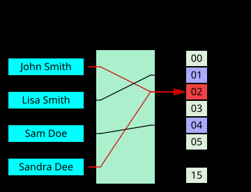

---
aliases:
  - CTF Notes
  - CTF Learning
  - Capture The Flag
  - Computer system
  - hash
  - hash function
tags:
  - flashcard/active/ctf
  - function/index
  - language/in/English
---

Hash functions converts any data to a fixed length hash digest.
- The digests should be easy to compute (?)
- Hash digests are irreversible * (can bruteforce)
- It should be hard to find two different data with same diges

The digest of hashing, the result of hashing, are called the hash value, hash code, or simply called hashes